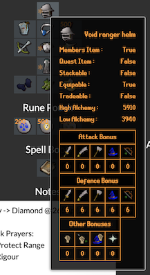
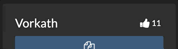
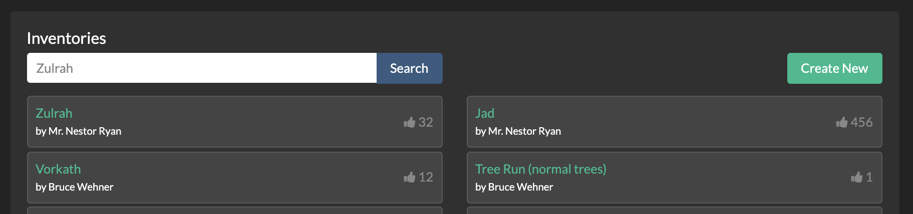

# OSRS Inventories
lorem ipsum

## Features
#### Inventory Builder/Viewer (with Import/Export)
lorem ipsum 

lorem ipsum 

lorem ipsum 

lorem ipsum 

lorem ipsum 

lorem ipsum 

#### Inventory Listings (with Export)
lorem ipsum 

#### Profile
lorem ipsum 

lorem ipsum 

## Installation
To get started with local development run the following in the root directory:
1. `composer install`
2. `npm install`

A [Makefile](https://makefiletutorial.com/) is used as a utility file, that you can execute commands like:
- Starting/Stop the local development server with
#### `make up` 
#### `make down` 
- Run a watcher for compling JS 
#### `make watch` 
- Feature/Unit testing
#### `make test` 
